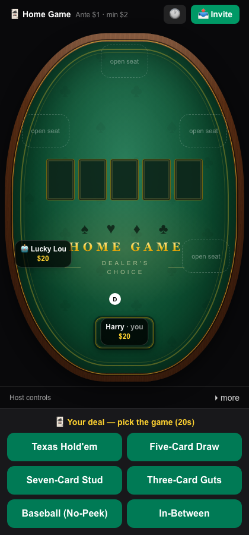
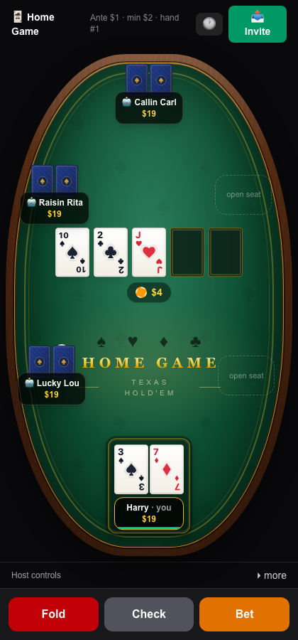
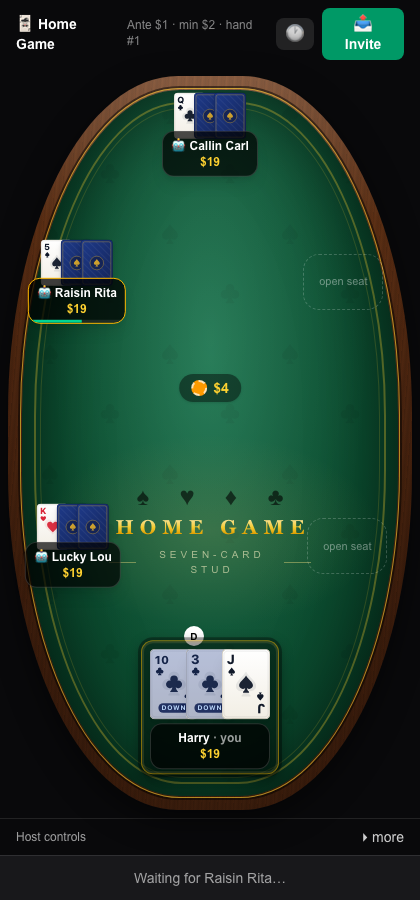
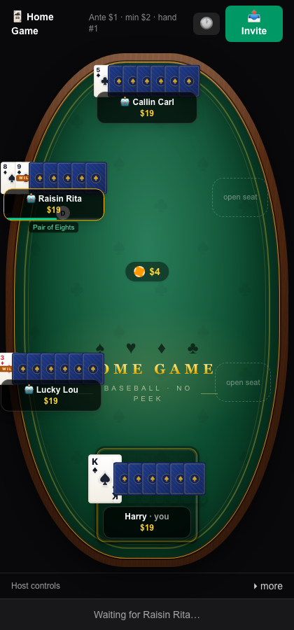
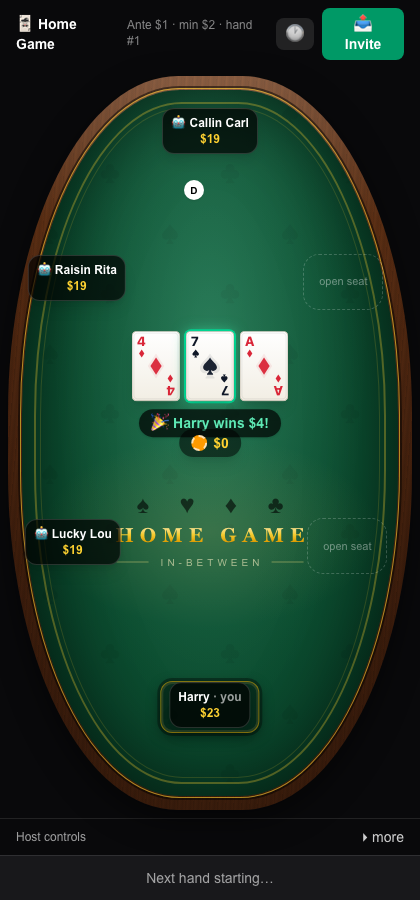

# 🃏 Home Game — Dealer's Choice

Poker night the way home games actually work: **the dealer calls the game.**

**Live:** https://home-game-dealers-choice.vercel.app

A mobile-first multiplayer poker table with a hidden automated dealer, forked from
[home-game-poker](https://github.com/hgardneriv/home-game-poker). No accounts: the
host creates a table, shares the link (native share sheet on phones), and approves
who sits down. Everyone antes every hand, the deal rotates, and when it's your deal
you pick the game from the table's enabled list. Play solo against 5 computer
players with one click, or host a friends game with 0–5 bots filling the empty
seats.

## The games

| Game | Status |
| --- | --- |
| Dealer picks the game each hand | ✅ Live |
| Texas Hold'em (ante-based) | ✅ Playable |
| 5-card draw (discard up to 3) | ✅ Playable |
| 7-card stud (door cards, best board opens) | ✅ Playable |
| 3-card guts (betting round, losers match the pot) | ✅ Playable |
| Baseball — 7-card no-peek, 3s & 9s wild | ✅ Playable |
| In-between (ace call, pay double on the post) | ✅ Playable |

When more than one game is enabled, the deal rotates and each dealer picks the
next game (bots pick too; an absent dealer repeats the last game). With exactly
one game enabled, hands deal straight in — a classic single-game night.

## What it looks like

Live gameplay on a phone (screenshots from the production table):

| Your deal — pick the game | Texas Hold'em | Seven-card stud | Baseball (no-peek) | In-between |
| :---: | :---: | :---: | :---: | :---: |
|  |  |  |  |  |
| Each dealer calls the game from the host-enabled list. | Ante poker: check-or-bet every street, live pot in the middle. | Your own face-down cards are shaded **DOWN**; up-cards are public. | Wild 3s/9s get a **WILD** band; made hands are labeled live for the table. | The played card lands *in between* and the result is announced to everyone. |

## House rules

- **Antes, not blinds.** Every dealt-in player posts the ante at the start of each
  hand (host-set, default $1). No small/big blind anywhere.
- **Check-or-bet opening.** First to act is left of the dealer on every street;
  betting is no-limit with a host-set minimum bet (default 2× ante).
- **The deal rotates** one seat per hand, skipping busted/empty seats. New joiners
  are dealt into the very next hand.
- **Table stakes.** You can never lose more than your stack — including in the
  pot-matching games (guts, in-between). Matched pots and unfinished in-between
  pots ride into the next hand, whatever game the next dealer calls.
- **Guts opens with a betting round.** After the three cards land, one
  check-or-bet street runs before the declares: a strong hand can sweeten what
  losers must match, and a bet must be called to earn the right to declare —
  folders are out of the hand.
- **In-between plays the pot down.** A pass burns no card, broke players sit
  out instead of being dealt dead turns, and the hand runs until the pot is
  emptied — it only carries to the next hand after three straight orbits where
  nobody wagers.
- **Top-ups.** Off by default; the host can allow a decaying rebuy schedule
  (disabled in quick play).
- **Bot games end with you.** In a table of bots (quick play), the game is over
  the moment the last human busts with no re-buy left — you get the standings,
  not a bot-only spectator mode.

## Features

- **6-seat table** with a correct rules engine: min-raise and short all-in rules,
  layered side pots with refunds, showdown order with auto-muck, odd-chip splits,
  ante-broke players automatically all-in
- **Plug-in game variants**: each game is a pure module (deal, phase progression,
  scoring, bot policy) behind one interface — new games can't touch the core
- **NPC bots** with personalities (tightness / aggression / bluff frequency) that
  decide from a redacted view — structurally unable to cheat
- **Invite-link multiplayer**: name-only entry, host approval of seats, per-game
  signed httpOnly cookie identity — a refresh or dropped connection restores your seat
- **Real-time** via Server-Sent Events with reconnect and mobile-background resync
- **Turn timers** (20s + 10s time bank, host-configurable) with auto check/fold,
  away state, and "I'm back"
- **Host controls**: approve/deny seats, choose enabled games, pause, kick,
  add/remove bots, end game (with final standings screen)
- **Casino-style table talk**: live made-hand labels under every seat (computed
  from face-up cards only — nothing hidden can leak), WILD bands on wild cards,
  DOWN shading on your own hidden cards in mixed-visibility games (stud), and
  in-between's played card revealed to the whole table with win/lose banners
  (and a DOUBLE BURN!!! marquee when someone hits the post)
- Responsive: portrait-first phone layout and desktop oval table; animated cards,
  chips, pot, and winner banners

## Stack

Next.js (App Router, TypeScript, Tailwind v4) · Upstash Redis (atomic
compare-and-set versioned state) · Motion (Framer Motion) · Vitest · Vercel
(Node runtime / Fluid Compute).

## Development

```bash
npm install
npm run dev        # http://localhost:3000 — uses in-memory storage if no Redis env
npm test           # engine + server suite (incl. 150-game fuzz with chip-conservation invariants)
npm run test:e2e:ci  # Playwright: hosts an in-between night vs bots and plays it
npm run lint
npx tsc --noEmit
```

For real-Redis local dev: `vercel env pull .env.local` (project must be linked with
`vercel link`).

Required env in production: `SESSION_SECRET`, plus `KV_REST_API_URL` /
`KV_REST_API_TOKEN` (auto-provisioned by the Upstash Marketplace integration).

## Deploy

Deployed on Vercel; deploys are CLI-based, never git-triggered. The target
project and team come from the gitignored `.vercel/` link — run `vercel link`
once in a fresh checkout, then:

```bash
vercel deploy --prod
```

See `CLAUDE.md` for the architecture deep-dive and contributor notes.
